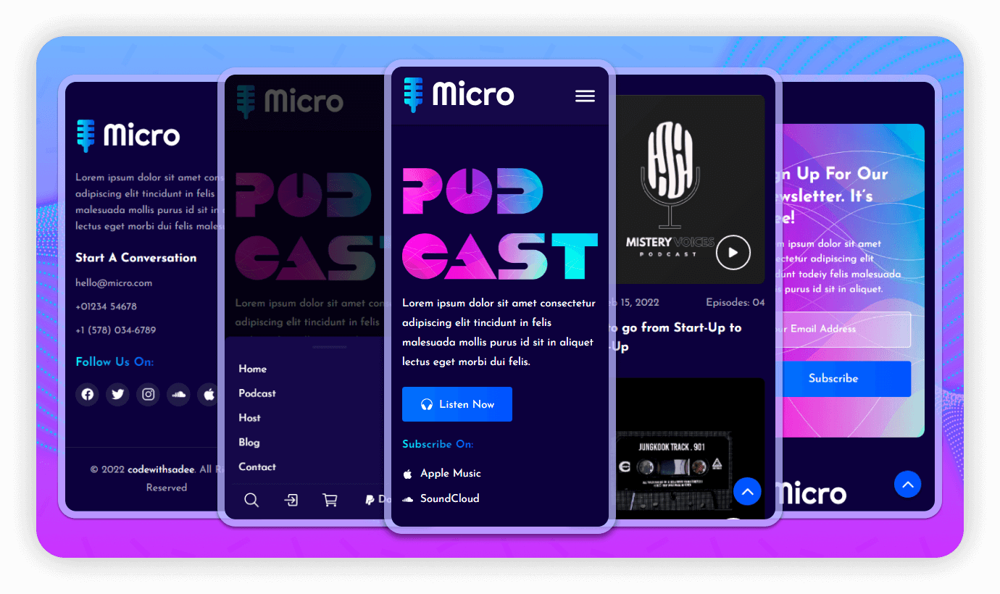

  
  
  
  

   
   
  
  

  <h2 align="center">Micro - Podcast website</h2>

  Micro is a fully responsive Podcast website,  Responsive for all devices, built using HTML, CSS, and JavaScript.

 

### Demo Screeshots

### Prerequisites

Before you begin, ensure you have met the following requirements:

* [Git](https://git-scm.com/downloads "Download Git") must be installed on your operating system.

### License

This project is **free to use** and does not contains any license.
# podcast
